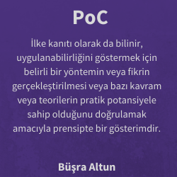
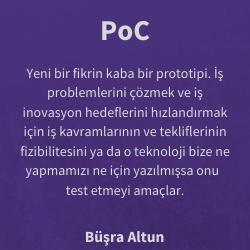
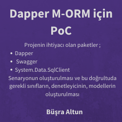
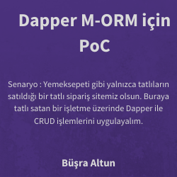
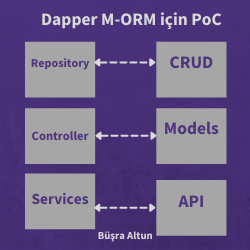

# BusraAltun_Odev2

<h1>ÖDEV2</h1>
<h2 style = "font-family:courier,arial,helvetica;">A. Normalization-Database Tasarımı</h2>

 Bu ödeve dair yaptığım çalışma repo içerisine yer almakla beraber bunun üzerine bir makale yazdım ve çalışmamdan bahsettim. İncelemek/değerlendirmek için butona tıklayınız.

<a target="blank" href="https://busraltunb.medium.com/tatl%C4%B1-bir-normalization-uygulamas%C4%B1-864a7cc7f2b9" >

<button  style="
background-color:white;border:1px solid green;
margin-top : 3%; margin-left : 30%;
width:103px;
height:103px;
border-radius: 50px;
-moz-border-radius: 50px;
-webkit-border-radius: 50px;">Tatlı Bir Normalizasyon <button>
 </a>
 

 
 Normalizasyonun uygulanması halinde oluşturulan tabloların database diagram aracılığıyla tasarıma dökülmüş hali ;
 

   

Bu çalışmanın adım adım anlatıldığı pdf e ulaşmak için butona tıklayınız.

<a target="blank" href="https://drive.google.com/file/d/1aNRkWEoB--lzyjdpgsR5jRlCIllhOErS/view" >

<button  style="
background-color:purple;border:1px solid white;
margin-top : 3%; margin-left : 30%;
width:103px;
height:103px;
border-radius: 50px;
-moz-border-radius: 50px;
-webkit-border-radius: 50px;">Pdf<button>
 </a>
 

 
 
 
 

<h2 style = "font-family:courier,arial,helvetica;">B.Dapper Micro-ORM ile Web API Çalışması ve PoC ile Çalışma</h2>

 Bu ödeve dair yaptığım çalışma repo içerisine yer almakla beraber bunun üzerine yerli yabancı kaynakları araştırmama dahil ederek bir makale yazdım ve makale içerisinde çalışmamdan bahsettim. İncelemek/değerlendirmek için butona tıklayınız.

<a target="blank" href="https://busraltunb.medium.com/micro-mu-orm-dapper-98c1b0516f04" >

<button  style="
background-color:white;border:1px solid green;
margin-top : 3%; margin-left : 30%;
width:103px;
height:103px;
border-radius: 50px;
-moz-border-radius: 50px;
-webkit-border-radius: 50px;">Dapper M-ORM / Dapper PoC <button>
 </a>
 

 PoC tan kısaca bahsettiğim ve verilen ödev üzerine uygulamaya çalıştığım PoC çalışması 
   

  

    

      
      

      

    

  

  

    

      
      

      

    

  

  

    

      
      

      

    

  

  

    

      
      

      

    

  

  

    

      
      

      

    

  

 
<h2 style = "font-family:courier,arial,helvetica;">C. Middleware Ödevi </h2>

Middleware için bir pdf çalışması oluşturuldu. Dolayısıyla Middleware klasörünün içerisine girdikten sonra çalışmaya erişmek için download edilmesi gerekmektedir. Yine de çalışmaya aşağıdaki link üzerinden ulaşabilirsiniz.

<a target="blank" href="https://drive.google.com/file/d/1egwcFQD8v_iTyWW-R4XtgFmphrQTmxpk/view?usp=sharing" >

<button  style="
background-color:purple;border:1px solid white;
margin-top : 3%; margin-left : 30%;
width:103px;
height:103px;
border-radius: 50px;
-moz-border-radius: 50px;
-webkit-border-radius: 50px;">Pdf<button>
 </a>
 

